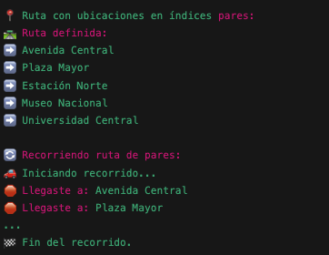

# parcial-practico

* Llevar a cabo la solución de los métodos pendientes TODO.
* Escoger el nombre de las ubicaciones del listado propuesto de la siguiente manera:
Si su último dígito de su código es par, escoger todas los nombres en las posiciones pares.
Caso contrario si su último dígito es impar

* Cree una rama con su apellido y código en mayúscula

Ejemplo:

MONTEALEGRE-0013833

En esa rama deberá incluir la solución

Salida esperada:

